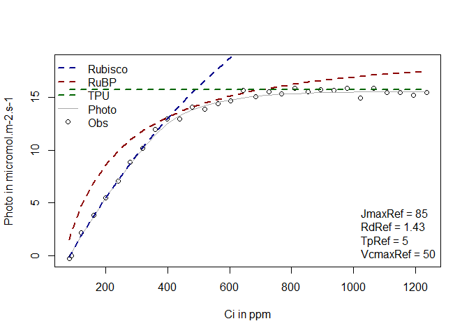
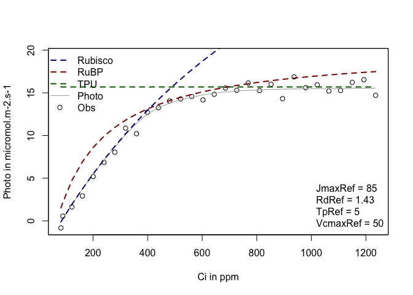
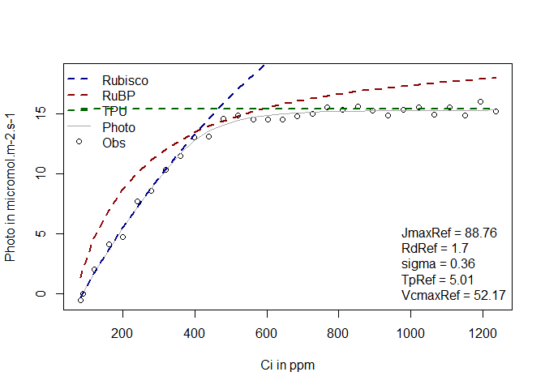

Aci\_fitting
================
Julien LAMOUR
10/16/2020

# Fitting an Aci curve

The objectif of this tutorial is to show how to fit an Aci curve using
the LeafGasExchange package. In this tutorial, an Aci curve is first
simulated with known photosynthetic parameters and noise. This curve is
then fitted to retrieve the parameters.

## Simulating an Aci curve

For this exemple we first simulate a photosynthesis curve, but it would
work the same if the data were not simulated but measured. The data
simulation is done using the function f.A. This function needs a list of
photosynthetic parameters which are produced using the function
f.make.param() and a list of input variables (CO2 at the surface of the
leaf, leaf temperature, incident light, RH). Too have more information
on the function f.make.param, you can use the command ?f.make.param in R
console.

``` r
param=f.make.param(VcmaxRef = 50,JmaxRef=50*1.7,TpRef=50/10)
CO2=seq(50,1500,50)
Tleaf=30+273.16
Tair=27+273.16
PAR=1800
RH=80
simul=f.A(PFD = PAR,cs = CO2,Tleaf = Tleaf,Tair = Tair,RH = RH,param = param)
simul$A=simul$A+rnorm(n = length(CO2),mean = 0,sd = 0.4)
measures=data.frame(Tleaf=Tleaf,Ci=simul$ci,PARi=PAR,Photo=simul$A)
```

We display this simulated curve using the function f.plot

``` r
f.plot(measures = measures,type = 'Aci',
       list_legend = param[c('VcmaxRef','JmaxRef','TpRef','RdRef')],
       param = param)
```

<!-- -->

\#\#Fitting an Aci curve

To fit an Aci curve, it is necessary to detail the parameter that we
want to estimate. All the parameters present in f.make.param can
potentially be fitted even if it would not always make sense. We do a
first fitting with only the parameters VcmaxRef, JmaxRef and RdRef.
Those parameters have to be given in the list Start, with initial
values. The method will look for different initial values around those
values so it is not necessary to give very good ones, just not too
stupid ones. The photosynthetic parameters have to be given in the list
param. This is used to determine what should be the parameters for the
temperature dependence, for the leaf absorbance, theta, etc. By default,
the equations and parameters used in the TBM FATES to simulate the
photosynthesis are used. In this example, we also give a very high value
to TpRef so the TPU limitation is not considered when fitting the curve.

``` r
fitting1=f.fitting(measures = measures,
                   Start = list(JmaxRef = 30, VcmaxRef = 50, RdRef = 1),
                   param=f.make.param(TpRef=50),
                   modify.init=TRUE,do.plot=TRUE,type='Aci')
```

    ## $par
    ##   JmaxRef  VcmaxRef     RdRef 
    ## 79.161990 49.179085  1.212728 
    ## 
    ## $value
    ## [1] 9.918262
    ## 
    ## $counts
    ## function gradient 
    ##      162       NA 
    ## 
    ## $convergence
    ## [1] 0
    ## 
    ## $message
    ## NULL
    ## 
    ## [1] "sd 0.57498585509885"
    ## Length  Class   Mode 
    ##      1   mle2     S4

<!-- -->

In the first exemple, the parameter TpRef was not included in the list
Start, so the TPU limitation was not included in the fitting. In this
second example, we now add TpRef in the list Start so the TPU limitation
is also evaluated.

``` r
fitting2=f.fitting(measures = measures,
                   Start = list(JmaxRef = 30, VcmaxRef = 50, RdRef = 1,TpRef=9),
                   param=f.make.param(),
                   modify.init=TRUE,do.plot=TRUE,type='Aci')
```

    ## $par
    ##   JmaxRef  VcmaxRef     RdRef     TpRef 
    ## 86.110531 50.072531  1.443516  5.005375 
    ## 
    ## $value
    ## [1] 2.244302
    ## 
    ## $counts
    ## function gradient 
    ##      277       NA 
    ## 
    ## $convergence
    ## [1] 0
    ## 
    ## $message
    ## NULL
    ## 
    ## [1] "sd 0.273514303065669"
    ## Length  Class   Mode 
    ##      1   mle2     S4

<!-- -->

The fitting corresponds to a list of 2 objects. The first object
corresponds to the fitting using a minimum square function whereas the
second object corresponds to a maximum likelihood which is made using
the package mle2. This latter method is usefull because it allowes us to
calculate the confidence interval of the parameters. The mean parameters
used to simulate the curves (VcmaxRef = 50,JmaxRef=85,TpRef=5,
RdRef=1.43 and sigma= 0.4) should be in the confidence interval.

``` r
confint(fitting2[[2]])
```

    ##               2.5 %     97.5 %
    ## sigma     0.2166631  0.3605745
    ## JmaxRef  83.6072505 88.7431597
    ## VcmaxRef 47.8350948 52.4863658
    ## TpRef     4.8836268  5.1300299
    ## RdRef     1.1144461  1.7869679

It is possible to compare the AIC of the two models using the base
function AIC. The lower AIC corresponds to the best model, showing that
in this case and as expected, the TPU limitation is usefull to improve
the fit of the model.

``` r
AIC(fitting1[[2]])
```

    ## [1] 59.93172

``` r
AIC(fitting2[[2]])
```

    ## [1] 17.35202
