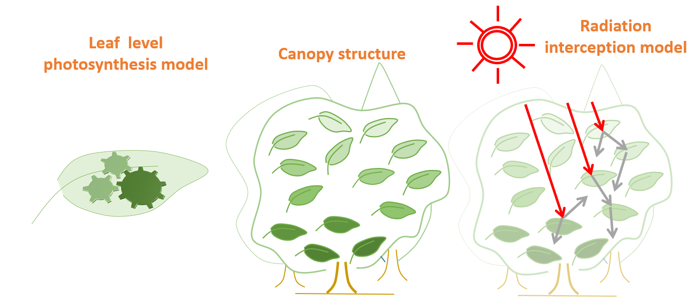
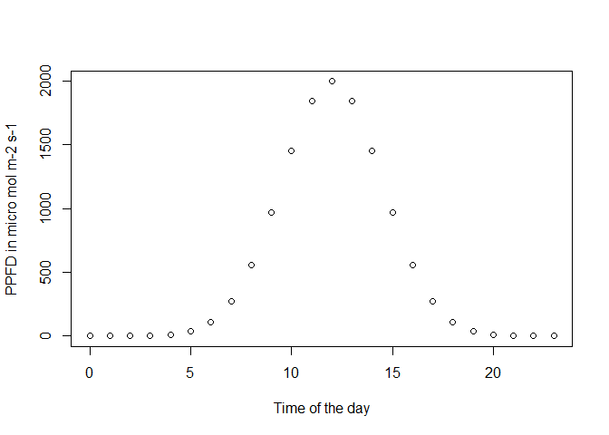
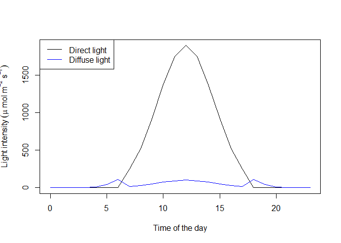
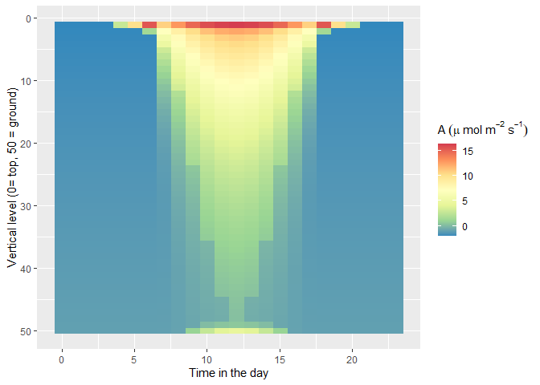
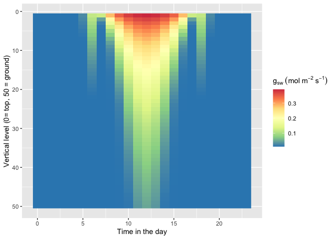

Canopy\_scaling
================
Julien LAMOUR
10/16/2020

# Canopy Scaling

The aim of this tutorial is to show how to scale the gas exchange
predictions from the leaf to the canopy. In this tutorial, several
assumptions are used to simulate the canopy photosynthesis (GPP) and the
transpiration. We consider that appart from the light, the
micrometeorological variables are homogenous inside the canopy (Air
temperature, wind, CO2, humidity). We also consider that the leaf size
and structure is homogenous. Those assumptions may be challenged if
needed. In this model we consider, as in most of the TBMs, that the
vertical gradients of leaf properties are similar for all the
photosynthetic parameters (Vcmax, Jmax, Tp and Td).

## Overall description of the canopy scaling

Basically, in most of the TBMs, the photosynthesis is modeled at the
leaf level and the scaling up to the canopy is made using two other
elements, the canopy structure and the canopy radiation interception.

<!-- -->

The leaf level photosynthesis is modeled using the function f.AT. This
function allows to simulate the leaf gas exchange using input
environmental variables surounding the leaves (PARi, wind, RH, Tair) and
leaf photosynthetic parameters (produced using the function
f.make.param()). This function couples 3 different models. The Farquhar
et al. 1980 model itself which describes the rate of photosynthesis from
the intracellular CO2, the leaf temperature and the light intensity
(PARi). Another model is the conductance model, which calculates the
intracellular CO2 from the leaf surface CO2 and environmental factors
that modify the conductance of the stomata. The last part of this model
is the leaf energy budget which calculates the leaf temperature knowing
the amount of energy that is received by the leaf and absorbed or
reimited. This part is represented by using the package tealeaves (Muir
2019)

The canopy structure corresponds to the vertical organisation of the
forest as well as its size, the size of the leaves, and their
orientation. The vertical gradients of leaf properties are also
represented, and notably the vertical structure of Vcmax, Jmax, TPU and
Rd. For those representations, different equations can be used, see for
example Clark et al. 2011, Lloyd et al. 2010 or Krinner et al. 2005. The
main function describing the canopy structure are obtained from the
package BioCro (<https://github.com/ebimodeling/biocro>).

The canopy radiation interception simulates the light levels that each
leaf receive inside the canopy. The light can be diffuse (shade leaf) or
direct (sunlit leaf) depending on the position. This time again, the
function from the package BioCro are used to describe the canopy
radiation interception.

## Simulation of the canopy structure

We first model the canopy structure, ie the leaf photosynthetic
gradients, the LAI and the total height of the canopy. We consider 50
vertical levels inside the canopy.

``` r
# Modeling of the LAI inside the 50 levels of the canopy, with a total LAI of 6.2
Canopy_Height=26
Total_LAI=6.2
LAI=seq(0,Total_LAI,Total_LAI/49)

# Modeling of the vertical structure of the Vcmax at 25 deg C (see the help of the function)
Vcmax=f.VcmaxRef.LAI(kn=0.11,LAI=LAI,Vcmax0=70)
# As in most TBM we model the other photosynthetic parameter from Vcmax
Jmax=1.7*Vcmax; Tp=1/5*Vcmax; Rd=0.03*Vcmax
# We consider that all the other leaf traits described in f.make.param are not vertically structured
```

## Simulation of the light inside the canopy

We first model the meterological conditions of a 24 h day. It would be
better to have real weather data but for the sake of this example, the
simulated data will work as well. Here, we only model the evolution of
light during the day, all the other meterological variables are
considered constant which is of course a (bad) simplification.

``` r
##Simulation of weather data
meteo_hourly=data.frame(time=0:23,rh=80,at=25,sr=dnorm(x = seq(0,23,1),mean = 12,sd = 2.5)/0.16*2000,tl=25)
plot(x=meteo_hourly$time,y=meteo_hourly$sr,xlab='Time of the day',ylab='PPFD in micro mol m-2 s-1')
```

<!-- -->

We now represent the light levels inside the canopy. The function is a
wrapper of sunML and lightME functions from BioCro. We encourage you to
go see the help of those functions. To summarize, they calculate the sun
angle on a position on the earth to calculate the amount of diffuse
light and direct light that will be received by the top of the canopy.
Then a two stream radiation interception model is used to calculate the
light levels inside the cnaopy.

``` r
canopy=f.canopy.interception(meteo_hourly=meteo_hourly,lat = 9.2801048,t.d = 0:23,DOY = 60,n_layers = 50,Height = Canopy_Height,LAI = Total_LAI)
```

<!-- -->

Finally, we calculate the GPP and transpiration of the canopy:

``` r
canopy_gasEx=f.GPP(TBM = "FATES",meteo_hourly =meteo_hourly,
                   Vcmax_Profile = Vcmax,Jmax_Profile =Jmax, Rd_Profile =Rd ,Tp_Profile = Tp,
                   g0_Profile = rep(0.02,length(Vcmax)),g1_Profile = rep(4,length(Vcmax)),
                   canopy=canopy,gsmin = 0.01)
```

<!-- --><!-- -->

    ## [1] "GPP =  2146.81520818625 g CO2 m-2 Ground Y-1"
    ## [1] "ET =  964.192951390878 L H20 m-2 Ground Y-1"

## References

Clark, D. B., Mercado, L. M., Sitch, S., Jones, C. D., Gedney, N., Best,
M. J., . Cox, P. M. (2011). The Joint UK Land Environment Simulator
(JULES), model description - Part 2: Carbon fluxes and vegetation
dynamics. Geoscientific Model Development, 4(3), 701-722.
<doi:10.5194/gmd-4-701-2011>

Farquhar, G.D., von Caemmerer, S. & Berry, J.A. A biochemical model of
photosynthetic CO2 assimilation in leaves of C3 species. Planta 149,
78–90 (1980).

Krinner, G., Viovy, N., de Noblet-Ducoudr?, N., Og?e, J., Polcher, J.,
Friedlingstein, P., . Prentice, I. C. (2005). A dynamic global
vegetation model for studies of the coupled atmosphere-biosphere system.
Global Biogeochemical Cycles, 19(1). <doi:10.1029/2003gb002199>

Lloyd, J., Pati?o, S., Paiva, R. Q., Nardoto, G. B., Quesada, C. A.,
Santos, A. J. B., . Mercado, L. M. (2010). Optimisation of
photosynthetic carbon gain and within-canopy gradients of associated
foliar traits for Amazon forest trees. Biogeosciences, 7(6), 1833-1859.
<doi:10.5194/bg-7-1833-2010>

Muir, C. D., tealeaves: an R package for modelling leaf temperature
using energy budgets, AoB PLANTS, Volume 11, Issue 6, December 2019,
plz054
