# Canopy Scaling


The aim of this tutorial is to show how to scale the gas exchange predictions from the leaf level to the canopy. In this tutorial, several assumptions are used to simulate the canopy photosynthesis (GPP) and the transpiration (ET). We consider that apart from the light, the micrometeorological variables are homogeneous inside the canopy (Air temperature, CO2, humidity). We also consider that the leaf size and structure is homogeneous. Those assumptions may be challenged if needed. In this model we consider, as in most of the TBMs, that the vertical gradients of leaf properties are similar for all the photosynthetic parameters (Vcmax, Jmax, Tp and Td).

## Overall description of the canopy scaling

Basically, in most of the TBMs, the photosynthesis is modeled at the leaf level and the scaling up to the canopy is made using two other elements, the canopy structure and the canopy radiation interception.

The leaf level photosynthesis is modeled using the function f.A. This function allows to simulate the leaf gas exchange using input environmental variables surrounding the leaves (PARi, RH, Tair, Tleaf) and the leaf photosynthetic parameters (produced using the function f.make.param()). This function couples 2 different models:  (i) The Farquhar et al. 1980 model itself which describes the rate of photosynthesis from the intracellular CO2 concentration, and (ii) the conductance model, which calculates the intracellular CO2 from the leaf surface CO2 and environmental factors that modify the conductance of the stomata. 

The canopy structure corresponds to the vertical organization of the forest the size of the leaves, and their orientation. The vertical gradients of leaf properties are also represented, and notably the vertical structure of Vcmax, Jmax, TPU and Rd. For those representations, different equations can be used, see for example Clark et al. 2011, Lloyd et al. 2010 or Krinner et al. 2005. 

The canopy radiation interception simulates the light levels that each leaf receive inside the canopy. The light can be diffuse (shaded leaves) or direct (sunlit leaves) depending on the position. The Norman radiation interception model (Norman 1979) is implemented as described in Bonan (2019).


## Simulation of the canopy structure

We first model the canopy structure, ie the leaf photosynthetic gradients, the LAI and the total height of the canopy. We consider 20 vertical levels inside the canopy.


```r
# Modeling of the LAI inside the 20 levels of the canopy, with a total LAI of 6.2
LAItot = 6
nlayers=20
dLAI=rep(6/nlayers,nlayers)
LAI=cumsum(dLAI)-dLAI/2 # LAI in the midle of each layer

# Modeling of the vertical structure of the Vcmax at 25 deg C (see the help of the function)
Vcmax=f.VcmaxRef.LAI(kn=0.11,LAI=LAI,Vcmax0=70)
# As in most TBM we model the other photosynthetic parameter from Vcmax
Jmax=1.7*Vcmax; Tp=1/5*Vcmax; Rd=0.03*Vcmax
# We consider that all the other leaf traits described in f.make.param are not vertically structured
```


## Simulation of the light inside the canopy

We first model the meterological conditions of a 24 h day. It would be better to have real weather data but for the sake of this example, the simulated data will work as well. Here, we only model the evolution of light during the day, all the other meterological variables are considered constant which is of course a (bad) simplification. 


```r
##Simulation of weather data
meteo_hourly=data.frame(time=0:23,RH=80,Tair=25,cs=400,PFD=dnorm(x = seq(0,23,1),mean = 12,sd = 2.5)/0.16*2000,Tleaf=25)
plot(x=meteo_hourly$time,y=meteo_hourly$PFD,xlab='Time of the day',ylab='PPFD in micro mol m-2 s-1')
```


We now represent the light levels inside the canopy. The function is a wrapper of lightME function from BioCro and the f.Norman.Radiation developped by Gordon Bonan (Bonan 2019). We encourage you to go and see the help of those functions. To summarize, they calculate the sun angle on a position on the earth to calculate the amount of diffuse light and direct light that will be received by the top of the canopy. Then the Norman interception model is used to calculate the light levels inside the canopy.


```r
lat=9.2801048
t.d = 0:23
DOY = 60

canopy=f.canopy.interception(meteo_hourly=meteo_hourly,lat = lat,t.d = t.d,DOY = DOY,nlayers = nlayers,dLAI = dLAI,LAI=LAI)
```

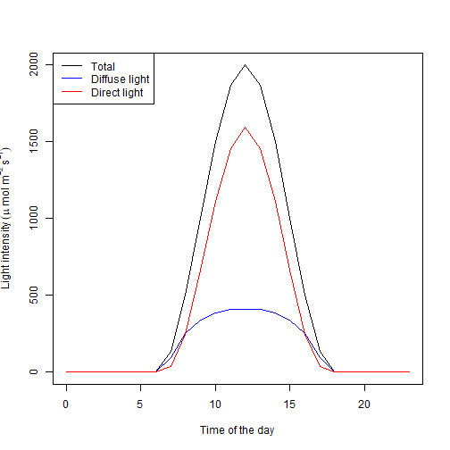

```
## [1] "Radiation model for a total LAI of  6"
## [1] "Radiation model for a total LAI of  6"
## [1] "Radiation model for a total LAI of  6"
## [1] "Radiation model for a total LAI of  6"
## [1] "Radiation model for a total LAI of  6"
## [1] "Radiation model for a total LAI of  6"
## [1] "Radiation model for a total LAI of  6"
## [1] "Radiation model for a total LAI of  6"
## [1] "Radiation model for a total LAI of  6"
## [1] "Radiation model for a total LAI of  6"
## [1] "Radiation model for a total LAI of  6"
## [1] "Radiation model for a total LAI of  6"
## [1] "Radiation model for a total LAI of  6"
## [1] "Radiation model for a total LAI of  6"
## [1] "Radiation model for a total LAI of  6"
## [1] "Radiation model for a total LAI of  6"
## [1] "Radiation model for a total LAI of  6"
## [1] "Radiation model for a total LAI of  6"
## [1] "Radiation model for a total LAI of  6"
## [1] "Radiation model for a total LAI of  6"
## [1] "Radiation model for a total LAI of  6"
## [1] "Radiation model for a total LAI of  6"
## [1] "Radiation model for a total LAI of  6"
## [1] "Radiation model for a total LAI of  6"
```

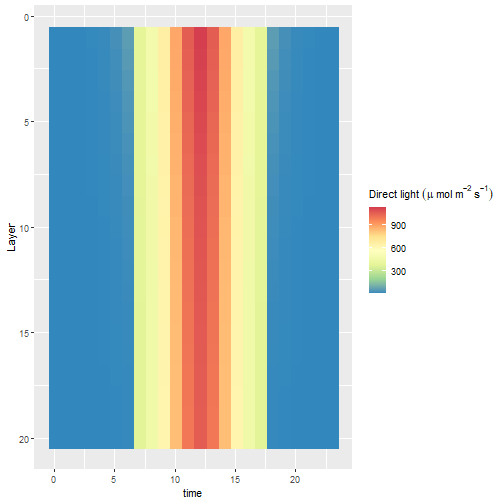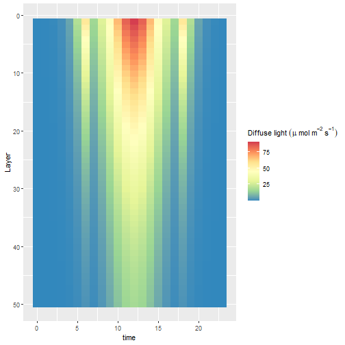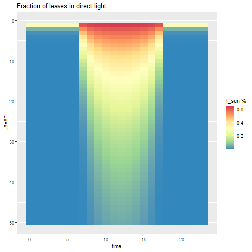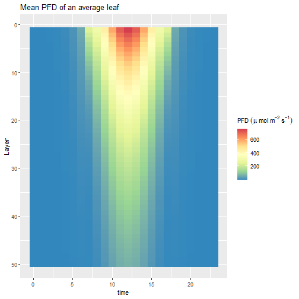

## Simulation of the GPP without leaf energy budget

Finally, we calculate the GPP and transpiration of the canopy:


```r
canopy_gasEx=f.GPP(TBM = "FATES",meteo_hourly =meteo_hourly,
                   Vcmax_Profile = Vcmax,Jmax_Profile =Jmax, Rd_Profile =Rd ,Tp_Profile = Tp,
                   g0_Profile = rep(0.02,length(Vcmax)),g1_Profile = rep(4,length(Vcmax)),
                   canopy=canopy,gsmin = 0.01)
```

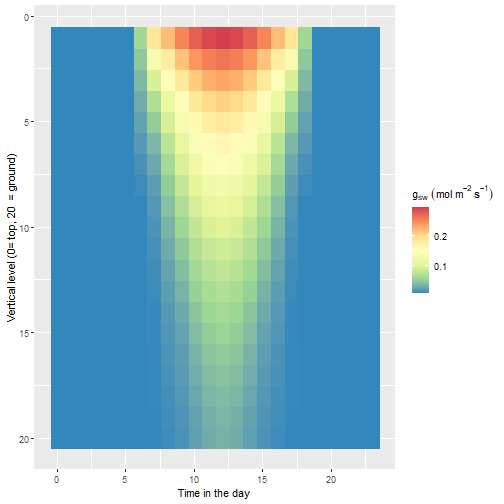

```
## [1] "GPP =  2779.74643205001 g CO2 m-2 Ground Y-1"
## [1] "ET =  975.083999036707 L H20 m-2 Ground Y-1"
```

## Simulation of the GPP with the leaf energy budget

Most of the times, the leaf temperature or canopy temperature is decoupled from the air temperature and the leaf temperature is unknown. A leaf energy budget allows the leaf temperature to be predicted. In our code, we use the Tealeaves package (Muir 2019) to implement the leaf energy budget and to predict the leaf temperature. Several factors modifies the leaf energy budget and we invite you to read the very nicely written paper associated with the Tealeaves package (Muir 2019) to understand them. The input radiation, the leaf conductance and the boundary layer modifies the leaf temperature. 
To model the leaf gas exchanges by taking into account the energy budget we use the fonction f.AT which is implemented in the function f.GPPT and works similarly to the function f.GPP that we just used.

In the canopy layer, the wind is considered to be stronger at the top of the canopy than on the ground following the Buckley et al. (2014) equation. The rest of the f.GPPT function works very similarly to the f.GPP function. Be careful however, the calculation time is much higher due to the time to compute the energy budget (several minutes for predicting a canopy with 20 layers).

We first add a wind column in our meteo_hourly dataframe wich is necessary for calculating the leaf temperature. For this example we consider that the wind is constant temporally over the course of the day and equal 2 m/s


```r
meteo_hourly$wind=2
```

We then make the predictions using f.GPPT


```r
canopy_gasExT=f.GPPT(TBM = "FATES",meteo_hourly =meteo_hourly,
                   Vcmax_Profile = Vcmax,Jmax_Profile =Jmax, Rd_Profile =Rd ,Tp_Profile = Tp,
                   g0_Profile = rep(0.02,length(Vcmax)),g1_Profile = rep(4,length(Vcmax)),
                   canopy=canopy,gsmin = 0.01)
```

```
## [1] "Layer 1 of 20 layers"
## [1] "Layer 2 of 20 layers"
## [1] "Layer 3 of 20 layers"
## [1] "Layer 4 of 20 layers"
## [1] "Layer 5 of 20 layers"
## [1] "Layer 6 of 20 layers"
## [1] "Layer 7 of 20 layers"
## [1] "Layer 8 of 20 layers"
## [1] "Layer 9 of 20 layers"
## [1] "Layer 10 of 20 layers"
## [1] "Layer 11 of 20 layers"
## [1] "Layer 12 of 20 layers"
## [1] "Layer 13 of 20 layers"
## [1] "Layer 14 of 20 layers"
## [1] "Layer 15 of 20 layers"
## [1] "Layer 16 of 20 layers"
## [1] "Layer 17 of 20 layers"
## [1] "Layer 18 of 20 layers"
## [1] "Layer 19 of 20 layers"
## [1] "Layer 20 of 20 layers"
```

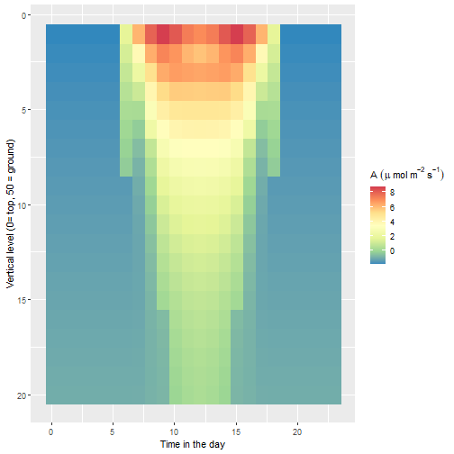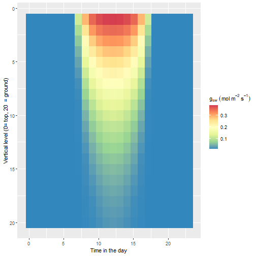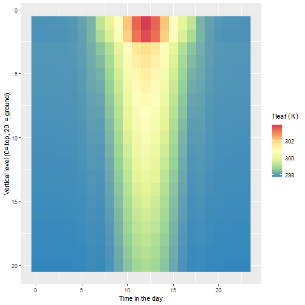

```
## [1] "GPP =  926.056287006624 g CO2 m-2 Ground Y-1"
## [1] "ET =  1311.29627596088 L H20 m-2 Ground Y-1"
```

By default three figures are produced which give the vertical and temporal variation of gsw, An and Tleaf in the canopy. Other figures can be produced using the output if needed.

For example, if we want to compute a figure with the CO2 at the leaf surface: 


```r
CO2_surface=(canopy_gasExT$cs_dir*canopy$f_sun+canopy_gasExT$cs_dif*(1-canopy$f_sun))
CO2_surface=melt(CO2_surface)
(ggplot(data=CO2_surface,aes(x=time,y=Layer,fill=value))+geom_raster()
     +scale_fill_distiller(palette = "Spectral", direction = -1) +scale_y_reverse()
     +xlab("Time in the day")
     +ylab(paste("Vertical level (0= top,",nlayers," = ground)"))
     +labs(fill=expression(C[s]~(ppm))))
```

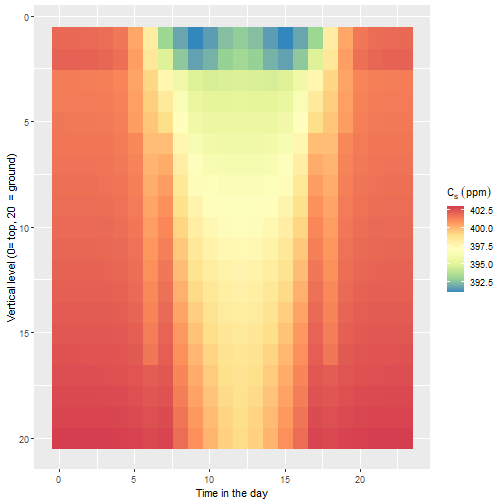

This calcul uses the proportion of leaves in the sun (f_sun) and their associated CO2 (cs_dir) and the proportion of shaded leaves (1-f_sun) with their associated CO2 (cs_dif).

We can do the same for the humidity at the leaf surface


```r
RH_surface=(canopy_gasExT$RHs_dir*canopy$f_sun+canopy_gasExT$RHs_dif*(1-canopy$f_sun))
RH_surface=melt(RH_surface)
(ggplot(data=RH_surface,aes(x=time,y=Layer,fill=value))+geom_raster()
     +scale_fill_distiller(palette = "Spectral", direction = -1) +scale_y_reverse()
     +xlab("Time in the day")
     +ylab(paste("Vertical level (0= top,",nlayers," = ground)"))
     +labs(fill=expression(RH[s]~('%'))))
```

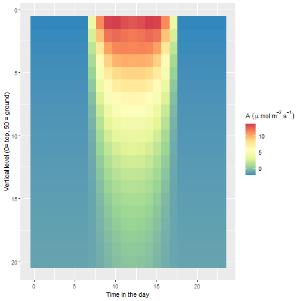


## References
Bonan, G. (2019). Climate change and terrestrial ecosystem modeling. Cambridge University Press.

Buckley, T. N., Martorell, S., Diaz‐Espejo, A., Tomàs, M., & Medrano, H. (2014). Is stomatal conductance optimized over both time and space in plant crowns? A field test in grapevine (V itis vinifera). Plant, Cell & Environment, 37(12), 2707-2721.

Clark, D. B., Mercado, L. M., Sitch, S., Jones, C. D., Gedney, N., Best, M. J., . Cox, P. M. (2011). The Joint UK Land Environment Simulator (JULES), model description - Part 2: Carbon fluxes and vegetation dynamics. Geoscientific Model Development, 4(3), 701-722. doi:10.5194/gmd-4-701-2011

Farquhar, G.D., von Caemmerer, S. & Berry, J.A. A biochemical model of photosynthetic CO2 assimilation in leaves of C3 species. Planta 149, 78–90 (1980).

Krinner, G., Viovy, N., de Noblet-Ducoudr?, N., Og?e, J., Polcher, J., Friedlingstein, P., . Prentice, I. C. (2005). A dynamic global vegetation model for studies of the coupled atmosphere-biosphere system. Global Biogeochemical Cycles, 19(1). doi:10.1029/2003gb002199

Lloyd, J., Pati?o, S., Paiva, R. Q., Nardoto, G. B., Quesada, C. A., Santos, A. J. B., . Mercado, L. M. (2010). Optimisation of photosynthetic carbon gain and within-canopy gradients of associated foliar traits for Amazon forest trees. Biogeosciences, 7(6), 1833-1859. doi:10.5194/bg-7-1833-2010

Muir, C. D., tealeaves: an R package for modelling leaf temperature using energy budgets, AoB PLANTS, Volume 11, Issue 6, December 2019, plz054

Norman, J. M. (1979). Modeling the complete crop canopy. ln: Barfield, G. Modification of the Aerial Environment of Crops. American Society of Agricultural Engineers, 249, 280.


