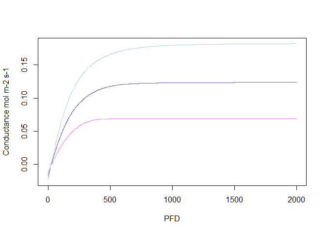

Guide to use the LeagGasExchange package to simulate leaf conductance
================
Julien LAMOUR
2/18/2021

## Simulation of simple conductance values

The “BWB” model (Ball et al. 1987) is: gs=g0+g1*A*RH/CO2s With g0 the
intercept for A == 0, and g1 the slope parameter

``` r
f.gs(A = 0:20,cs = 400,RH = 70,g0 = 0.01,g1 = 6,model='BWB')
```

    ##  [1] 0.0100 0.0205 0.0310 0.0415 0.0520 0.0625 0.0730 0.0835 0.0940 0.1045
    ## [11] 0.1150 0.1255 0.1360 0.1465 0.1570 0.1675 0.1780 0.1885 0.1990 0.2095
    ## [21] 0.2200

The “USO” model (Medlyn et al. 2011) is: gs = g0+ 1.6 \* (1 + g1 \* A /
(ds^0.5 \* CO2s)) and can be simplified in the “USO\_simpl” model :  
gs = g0+ 1.6 \* g1 *A / (ds^0.5 * CO2s)

``` r
f.gs(A = 0:20,cs = 400,ds = 1000,g0 = 0.01,g1 = 6,model='USO')
```

    ##  [1] 0.010 0.038 0.066 0.094 0.122 0.150 0.178 0.206 0.234 0.262 0.290 0.318
    ## [13] 0.346 0.374 0.402 0.430 0.458 0.486 0.514 0.542 0.570

``` r
f.gs(A = 0:20,cs = 400,ds = 1000,g0 = 0.01,g1 = 6,model='USO_simpl')
```

    ##  [1] 0.010 0.034 0.058 0.082 0.106 0.130 0.154 0.178 0.202 0.226 0.250 0.274
    ## [13] 0.298 0.322 0.346 0.370 0.394 0.418 0.442 0.466 0.490

## Using the photosynthesis model

``` r
PFD=0:2000
USO_simulation=f.A(PFD = PFD,cs = 400,Tleaf = 25+273.16,Tair = 25+273.16,RH = 70,param = f.make.param(g0=00,g1=3,model.gs = "USO"))
USO_simpl_simulation=f.A(PFD = PFD,cs = 400,Tleaf = 25+273.16,Tair = 25+273.16,RH = 70,param = f.make.param(g0=0,g1=3,model.gs = "USO_simpl"))
BWB_simulation=f.A(PFD = PFD,cs = 400,Tleaf = 25+273.16,Tair = 25+273.16,RH = 70,param = f.make.param(g0=0.0,g1=5,model.gs = "BWB"))

plot(x=PFD,y=USO_simulation$gs,type='l',ylab='Conductance mol m-2 s-1',col='lightblue')
lines(x=PFD,y=USO_simpl_simulation$gs,col='slateblue3')
lines(x=PFD,y=BWB_simulation$gs,col='orchid1')
```

<!-- -->

## References

Ball, J. T., Woodrow, I. E., & Berry, J. A. (1987). A model predicting
stomatal conductance and its contribution to the control of
photosynthesis under different environmental conditions. In Progress in
photosynthesis research (pp. 221-224). Springer, Dordrecht.

Medlyn, B.E., Duursma, R.A., Eamus, D., Ellsworth, D.S., Prentice, I.C.,
Barton, C.V.M., Crous, K.Y., De Angelis, P., Freeman, M. and Wingate, L.
(2011), Reconciling the optimal and empirical approaches to modelling
stomatal conductance. Global Change Biology, 17: 2134-2144.
