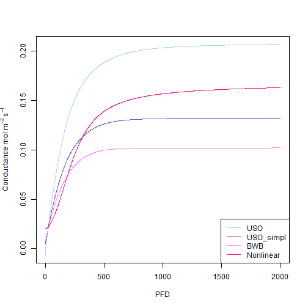

## Simulation of conductance knowing the photosynthesis rate

It is possible to simulate the leaf water stomatal conductance using the function f.gs. The function allows to simulate different conductance models: the one from Ball et al. (1987) noted "BWB", the two versions from Medlyn et al. (2011), i.e. the USO model "USO" and the approximation of the USO model "USO_simpl" which is similar to previously published empirical models (such as the BWB model). A new version is also included which is nonlinear "Nonlinear". 

The "BWB" model (Ball et al. 1987) is:


With g0 the intercept for A == 0, and g1 the slope parameter. RH corresponds to the relative humidity and CO2s to the CO2 concentration at the leaf surface. 


```r
A=-2:20
cs=400
RH=70
g0=0.02
g1_BWB=6
BWB_gs=f.gs(A = A,cs = cs,RH = RH,g0 = g0,g1 = g1_BWB,model='BWB')
```

The "USO" model (Medlyn et al. 2011) is: 


It can be simplified in the "USO_simpl" model :  


Those models don't use the relative humidity but the leaf to air vapor pressure deficit (not clear in the paper, could also be the Air vapor pressure deficit VPDA. In this model, the VPDleaf is used)


```r
ds=1000
USO_gs=f.gs(A = A,cs = cs,ds = ds,g0 = g0,g1 = g1_BWB,model='USO')
```


```r
USO_simpl_gs=f.gs(A = A,cs = cs,ds = ds,g0 = g0,g1 = g1_BWB,model='USO_simpl')
```

Finally, a "Nonlinear" version of the USO_simpl conductance model is also implemented: 


Note that the gross assimilation (Ag = An + Rdark) is used instead of the net assimilation. 


```r
Rd=2
g1_Nonlinear=0.23
Nonlinear_gs=f.gs(A = A,cs = cs,ds = ds,g0 = g0,g1 = g1_Nonlinear, Rd=Rd,model='Nonlinear')
```


## Estimation of the conductance parameters g0 and g1 using linear regressions


The parameters g0 and g1 of the 4 models can be estimated using linear regressions:


with Y the response variable, X the regressor and epsilon the residual. For all the models except "USO" Y corresponds to the conductance. 


```r
X_BWB=A*RH/100/cs
X_USO_simpl=1.6*A/cs/sqrt(ds/1000)
X_Nonlinear=1.6*(A+Rd)^2/sqrt(ds/1000)/cs

lm(BWB_gs~X_BWB)
```

```
## 
## Call:
## lm(formula = BWB_gs ~ X_BWB)
## 
## Coefficients:
## (Intercept)        X_BWB  
##        0.02         6.00
```

```r
lm(USO_simpl_gs~X_USO_simpl)
```

```
## 
## Call:
## lm(formula = USO_simpl_gs ~ X_USO_simpl)
## 
## Coefficients:
## (Intercept)  X_USO_simpl  
##        0.02         6.00
```

```r
lm(Nonlinear_gs~X_Nonlinear)
```

```
## 
## Call:
## lm(formula = Nonlinear_gs ~ X_Nonlinear)
## 
## Coefficients:
## (Intercept)  X_Nonlinear  
##        0.02         0.23
```

In those examples you see that g0 and g1 were correctly estimated, i.e. they were the same as the ones used to simulate the data.

For the non simplified USO model, a linear regression can also be performed but with : 


```r
Y_USO= USO_gs - 1.6 * A/cs
X_USO=regressor_USO_simpl
```

```
## Error in eval(expr, envir, enclos): object 'regressor_USO_simpl' not found
```

```r
lm(Y_USO~X_USO)
```

```
## Error in eval(predvars, data, env): object 'X_USO' not found
```

## Simulation of conductance using a coupled photosynthesis - conductance model

In the previous examples, the conductance was simulated using the photosynthesis (An or Ag) as an input variable. However, in reality both the conductance and the photosynthesis are linked and influence each other. It is possible to simulate the photosynthesis and the conductance together using the f.A function which simulates the leaf gas exchange.


```r
PFD=0:2000
USO_simulation=f.A(PFD = PFD,cs = 400,Tleaf = 25+273.16,Tair = 25+273.16,RH = 70,param = f.make.param(g0=0.02,g1=3,model.gs = "USO"))
USO_simpl_simulation=f.A(PFD = PFD,cs = 400,Tleaf = 25+273.16,Tair = 25+273.16,RH = 70,param = f.make.param(g0=0.02,g1=2.67,model.gs = "USO_simpl"))
BWB_simulation=f.A(PFD = PFD,cs = 400,Tleaf = 25+273.16,Tair = 25+273.16,RH = 70,param = f.make.param(g0=0.02,g1=5,model.gs = "BWB"))
Nonlinear_simulation=f.A(PFD = PFD,cs = 400,Tleaf = 25+273.16,Tair = 25+273.16,RH = 70,param = f.make.param(g0=0.02,g1=0.23,model.gs = "Nonlinear",VcmaxRef=55,RdRef=0.015*55,JmaxRef=1.67*55,TpRef = 20,TBM = "CLM4.5"))
plot(x=PFD,y=USO_simulation$gs,type='l',ylab=expression(Conductance~ mol~m^-2~s^-1),col='lightblue')
lines(x=PFD,y=USO_simpl_simulation$gs,col='slateblue3')
lines(x=PFD,y=BWB_simulation$gs,col='orchid1')
lines(x=PFD,y=Nonlinear_simulation$gs,col='deeppink2')
legend('bottomright',col = c('lightblue','slateblue3','orchid1','deeppink2'),lty = c(1,1,1,1),legend=c("USO","USO_simpl","BWB","Nonlinear"))
```



The transpiration is also an output of the f.A function:


```r
plot(x=PFD,y=USO_simulation$Transp,type='l',ylab=expression(Transpiration~ mL~m^-2~s^-1),col='lightblue')
lines(x=PFD,y=USO_simpl_simulation$Transp,col='slateblue3')
lines(x=PFD,y=BWB_simulation$Transp,col='orchid1')
lines(x=PFD,y=Nonlinear_simulation$Transp,col='deeppink2')
legend('bottomright',col = c('lightblue','slateblue3','orchid1','deeppink2'),lty = c(1,1,1,1),legend=c("USO","USO_simpl","BWB","Nonlinear"))
```


## References
Ball, J. T., Woodrow, I. E., & Berry, J. A. (1987). A model predicting stomatal conductance and its contribution to the control of photosynthesis under different environmental conditions. In Progress in photosynthesis research (pp. 221-224). Springer, Dordrecht.

Medlyn, B.E., Duursma, R.A., Eamus, D., Ellsworth, D.S., Prentice, I.C., Barton, C.V.M., Crous, K.Y., De Angelis, P., Freeman, M. and Wingate, L. (2011), Reconciling the optimal and empirical approaches to modelling stomatal conductance. Global Change Biology, 17: 2134-2144. 

