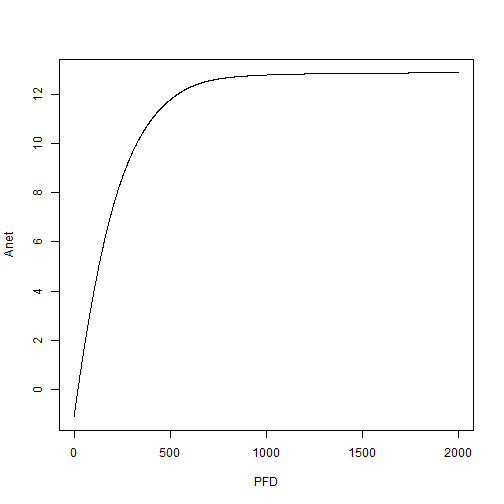
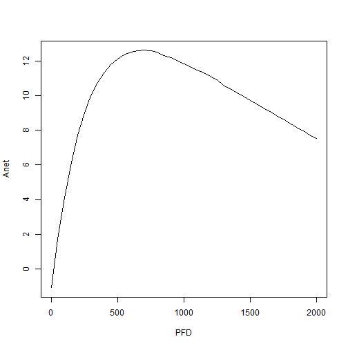

## Description of the photosynthesis model

The package LeafGasExchange can be used to simulate the photosynthesis at the leaf level using the function f.AT(). The FvCB photosynthesis model (Farquhar et al. 1980) is coupled with the USO model (Medlyn et al. 2011) and an energy balance model (Muir 2019). 

The input variables for this model are:

* Photosynthetic photon flux density, PFD in micro mol m-2 s-1

* CO2 at the surface of the leaf, cs in ppm

* Air temperature at the surface of the leaf, Tair in degree K

* Air relative humidity, RH in percent (between 0 and 100)

* Wind speed at the surface of the leaf, wind in m s-1

The parameters for this function are the parameters of the photosynthesis and stomata models. The list of parameters is described in the help of the function f.make.param. It includes notably the parameters Vcmax, Jmax, Tp, Rd at 25 degree C and g0 and g1.

In addition to those parameters, the parameters precision and max_it can be modified. By default their value are 0.1 degree C and 10, respectively. To better understand, the energy budget is calculated iteratively. Temperature convergence is achieved when the prior leaf temperature which is guessed and the predicted temperature are within the accuracy range given by the parameter 'precision' (default to 0.1 degree C). If more than max_it iterations are needed for the temperature to converge, then the calculation stops. Both parameters can be changed depending on the accuracy needed, the more the precision wanted, the more iteration the calculation will need.

The output variables are:

* the net assimilation, A, in micro mol m-2 s-1

* the rubisco limited assimilation rate, Ac, in micro mol m-2 s-1

* the electron transport limited assimilation rate, Aj, in micro mol m-2 s-1

* the export limited assimilation rate, Ap, in micro mol m-2 s-1

* the leaf water conductance, gs, in mol m-2 s-1

* The CO2 concentration inside the stomata cavity, ci, in ppm

* The leaf temperature, Tleaf, in degree K

* The vapour pressure deficit between the leaf and the surounding atmosphere, ds, in Pa

* The transpiration rate of the leaf in g m-2 s-1

## Installation of the package from github
First, the package devtools is needed to install the package LeafGasExchange from github. If you don't have devtools you have to first install it and load it.


```r
require(devtools)
```

The LeafGasExchange package can then be downloaded, installed and loaded using the folowing commands:

```r
install_github('https://github.com/TESTgroup-BNL/LeafGasExchange.git')
```


```r
library(LeafGasExchange)
```

## Creation of a list of parameters used by the f.AT() function

The function f.make.param() can be used to create a list of photosynthetic parameters. By default, the parameters are the one from the Functionnaly Assembled Terrestrial Ecosystem Simulator for tropical species.


```r
library(LeafGasExchange)
param<-f.make.param()
print(param)
```

```
## $TBM
## [1] 0
## 
## $R
## [1] 8.314
## 
## $O2
## [1] 210
## 
## $TRef
## [1] 298.16
## 
## $Patm
## [1] 101
## 
## $JmaxRef
## [1] 83.5
## 
## $JmaxHa
## [1] 43540
## 
## $JmaxHd
## [1] 152040
## 
## $JmaxS
## [1] 495
## 
## $VcmaxRef
## [1] 50
## 
## $VcmaxHa
## [1] 65330
## 
## $VcmaxHd
## [1] 149250
## 
## $VcmaxS
## [1] 485
## 
## $VcmaxQ10
## [1] NA
## 
## $Tlow
## [1] NA
## 
## $Tup
## [1] NA
## 
## $TpRef
## [1] 8.333333
## 
## $TpHa
## [1] 53100
## 
## $TpHd
## [1] 150650
## 
## $TpS
## [1] 490
## 
## $thetacj
## [1] 0.999
## 
## $thetaip
## [1] 0.999
## 
## $RdRef
## [1] 1.43
## 
## $RdHa
## [1] 46390
## 
## $RdHd
## [1] 150650
## 
## $RdS
## [1] 490
## 
## $KcRef
## [1] 404.9
## 
## $KcHa
## [1] 79430
## 
## $KcQ10
## [1] NA
## 
## $KoRef
## [1] 278.4
## 
## $KoHa
## [1] 36380
## 
## $KoQ10
## [1] NA
## 
## $GstarRef
## [1] 42.75
## 
## $TauRef
## [1] NA
## 
## $TauQ10
## [1] NA
## 
## $GstarHa
## [1] 37830
## 
## $abso
## [1] 0.85
## 
## $aQY
## [1] 0.425
## 
## $Theta
## [1] 0.7
## 
## $g0
## [1] 0.02
## 
## $g1
## [1] 4.1
## 
## $model.gs
## [1] 0
## 
## $power
## [1] 0.5
## 
## $gmRef
## [1] NA
## 
## $gmS
## [1] NA
## 
## $gmHa
## [1] NA
## 
## $gmHd
## [1] NA
```

It is possible to change some or all of the parameters by modifying the parameters in the call of the function f.make.param(). An example is given below where JmaxRef, VcmaxRef, RdRef and g0 and g1 are modified.


```r
param<-f.make.param(JmaxRef = 100,VcmaxRef = 60,RdRef = 1,g0 = 0.02,g1=4)
print(param)
```

```
## $TBM
## [1] 0
## 
## $R
## [1] 8.314
## 
## $O2
## [1] 210
## 
## $TRef
## [1] 298.16
## 
## $Patm
## [1] 101
## 
## $JmaxRef
## [1] 100
## 
## $JmaxHa
## [1] 43540
## 
## $JmaxHd
## [1] 152040
## 
## $JmaxS
## [1] 495
## 
## $VcmaxRef
## [1] 60
## 
## $VcmaxHa
## [1] 65330
## 
## $VcmaxHd
## [1] 149250
## 
## $VcmaxS
## [1] 485
## 
## $VcmaxQ10
## [1] NA
## 
## $Tlow
## [1] NA
## 
## $Tup
## [1] NA
## 
## $TpRef
## [1] 8.333333
## 
## $TpHa
## [1] 53100
## 
## $TpHd
## [1] 150650
## 
## $TpS
## [1] 490
## 
## $thetacj
## [1] 0.999
## 
## $thetaip
## [1] 0.999
## 
## $RdRef
## [1] 1
## 
## $RdHa
## [1] 46390
## 
## $RdHd
## [1] 150650
## 
## $RdS
## [1] 490
## 
## $KcRef
## [1] 404.9
## 
## $KcHa
## [1] 79430
## 
## $KcQ10
## [1] NA
## 
## $KoRef
## [1] 278.4
## 
## $KoHa
## [1] 36380
## 
## $KoQ10
## [1] NA
## 
## $GstarRef
## [1] 42.75
## 
## $TauRef
## [1] NA
## 
## $TauQ10
## [1] NA
## 
## $GstarHa
## [1] 37830
## 
## $abso
## [1] 0.85
## 
## $aQY
## [1] 0.425
## 
## $Theta
## [1] 0.7
## 
## $g0
## [1] 0.02
## 
## $g1
## [1] 4
## 
## $model.gs
## [1] 0
## 
## $power
## [1] 0.5
## 
## $gmRef
## [1] NA
## 
## $gmS
## [1] NA
## 
## $gmHa
## [1] NA
## 
## $gmHd
## [1] NA
```

## Predicting the photosynthesis 

Prediction of the photosynthesis using the previous list of parameters and different leaf conditions is done in the following way:


```r
Leaf_photo=f.AT(PFD = 1500,ca = 400,Tair = 273.15+29,RHa = 70,wind = 2,param = param)
print(Leaf_photo)
```

```
##          A       Ac      Aj       Ap       Ag        gs       ci       ds     Transp      gbw     cs
## 1 9.827052 9.887746 12.0333 27.37827 10.88575 0.1638462 303.9644 2262.238 0.06605806 1.443636 390.47
##       RHs    Tleaf
## 1 59.7955 306.3139
```

In this case the leaf temperature was predicted by the function. If the leaf temperature is known, it is possible to use the function f.A


```r
Leaf_photo2=f.A(PFD = 1000,cs = 400,Tair = 273.15+29,Tleaf = 303,RH = 70,param = param)
print(Leaf_photo2)
```

```
## $A
## [1] 12.781
## 
## $Ac
## [1] 13.00088
## 
## $Aj
## [1] 13.72704
## 
## $Ap
## [1] 27.62239
## 
## $Ag
## [1] 13.88129
## 
## $gs
## [1] 0.2438359
## 
## $ci
## [1] 316.0173
## 
## $ds
## [1] 1401.926
## 
## $Transp
## [1] 0.06092196
```

The function f.A accepts vectors as input variables, so it is possible to simulate a light curve or an CO2 curve easily:


```r
Leaf_photo3=f.A(PFD = 0:2000,cs = 400,Tair = 273.15+29,Tleaf = 303,RH = 70,param = param)
plot(x=0:2000,y = Leaf_photo3$A,xlab='PFD',ylab='Anet',type='l')
```



Similarly, it is possible to simulate a light curve by considering the leaf energy budget. The simulation is more computational intensive than without the energy budget. So it is important to reduce the number of simulation cases. Here the light curve is simulated with a resolution of 50 PFD between each point of the curve, instead of a resolution of 1 as done previously. 


```r
Leaf_photo4=f.AT(PFD = seq(0,2000,50),ca = 400,Tair = 273.15+29,wind=2,RHa = 80,param = param)
plot(x=seq(0,2000,50),y = Leaf_photo4$A,xlab='PFD',ylab='Anet',type='l')
```




## References

Farquhar, G.D., von Caemmerer, S. & Berry, J.A. A biochemical model of photosynthetic CO2 assimilation in leaves of C3 species. Planta 149, 78–90 (1980). 

Medlyn, B.E., Duursma, R.A., Eamus, D., Ellsworth, D.S., Prentice, I.C., Barton, C.V.M., Crous, K.Y., De Angelis, P., Freeman, M. and Wingate, L. (2011), Reconciling the optimal and empirical approaches to modelling stomatal conductance. Global Change Biology, 17: 2134-2144. 

Christopher D Muir, tealeaves: an R package for modelling leaf temperature using energy budgets, AoB PLANTS, Volume 11, Issue 6, December 2019, plz054
